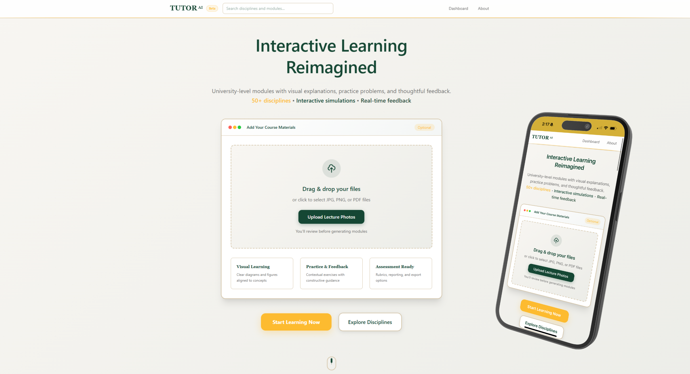

# Class Tutor - AI-Powered Learning Platform

> Transform lecture photos into interactive learning modules across 52 academic disciplines



## What is Class Tutor?

Class Tutor is an AI-powered educational platform that automatically converts lecture photos into structured, interactive learning modules. Students upload photos of lecture slides, and our AI creates comprehensive learning experiences with problems, visualizations, YouTube videos, and progress tracking.

### Key Features

- **Photo-to-Module**: Upload lecture photos → AI creates structured learning content
- **Intelligent Discipline Selection**: AI automatically selects the most appropriate discipline from 52 academic options
- **AI-Powered Visualizations**: 8 interactive D3.js diagrams (tree, cluster, force-directed, bar, line, scatter, pie, plus AI auto-selection)
- **YouTube Video Integration**: AI-generated search queries fetch relevant educational videos with lazy loading
- **Smart Problem Generation**: Context-aware problems with AI grading
- **Progress Tracking**: Persistent user progress with PostgreSQL database
- **Multi-Discipline Support**: 52 academic disciplines across 7 colleges
- **Google OAuth Authentication**: Full user account system with profile management
- **Photo Attribution**: Track user contributions and module ownership with contributor tags
- **Module Photos Tab**: Dedicated tab showing all lecture photos with contributor attribution
- **Beta Access Control**: Password-based authentication for controlled testing

## Architecture

```
┌─────────────────┐    ┌─────────────────┐    ┌─────────────────┐
│    FRONTEND     │    │     BACKEND     │    │     SHARED      │
│                 │    │                 │    │                 │
│ React 19 + TS,  │◄──►│ Express + TS,   │◄──►│ Zod Schemas +   │
│ Vite + Tailwind,│    │ PostgreSQL,     │    │ TypeScript      │
│ D3.js + Router  │    │ LLM Providers   │    │ Types           │
└─────────────────┘    └─────────────────┘    └─────────────────┘
```

### Technology Stack

- **Frontend**: React 19 + TypeScript + Vite + Tailwind CSS + D3.js
- **Backend**: Node.js + Express + TypeScript + PostgreSQL
- **AI**: Multiple providers for content analysis and generation
- **Database**: PostgreSQL with connection pooling
- **Deployment**: Vercel (frontend) + Render (backend + database)

## Quick Start

### Prerequisites
- Node.js 18+
- PostgreSQL database
- LLM API key

### Installation

1. **Clone and install dependencies**
   ```bash
   git clone https://github.com/gbsierra/Tutor-AI.git
   cd Class-Tutor
   npm install
   ```

2. **Set up environment variables**
   ```bash
   # Backend environment
   cd backend
   cp .env.example .env
   # Add your GEMINI_API_KEY, DATABASE_URL, and YOUTUBE_API_KEY
   ```

3. **Initialize database**
   ```bash
   cd backend
   npm run setup-db
   ```

4. **Start development servers**
   ```bash
   # Terminal 1: Backend
   npm run dev:backend
   
   # Terminal 2: Frontend  
   npm run dev:frontend
   ```

5. **Access the application**
   - Frontend: http://localhost:5173
   - Backend: http://localhost:3000
   - Health check: http://localhost:3000/healthz

## 📁 Project Structure

```
Class-Tutor/
├── frontend/          # React application
├── backend/           # Express API server
├── shared/            # Shared types and schemas
├── docs/              # Project documentation
└── package.json       # Workspace configuration
```

## API Endpoints
All endpoints use the `/api` prefix:

### Public Endpoints (No Authentication Required)
- **Modules**: `/api/modules/*` - Module access and recent modules
- **Disciplines**: `/api/disciplines/*` - Discipline data and context
- **Problems**: `/api/problems/generate` - Problem generation
- **Simulations**: `/api/simulations/*` - D3.js visualization generation
- **Visualizations**: `/api/visualizations/*` - Visualization persistence
- **YouTube**: `/api/youtube/*` - YouTube video integration
- **Search**: `/api/search` - Search across disciplines and modules
- **Photos**: `/api/photos/recent` - Recent photos for landing page

### Authenticated Endpoints (Require User Authentication)
- **User Profile**: `/api/users/me/*` - User contributions and photo attribution
- **Problem Grading**: `/api/problems/grade` - Problem grading and feedback
- **Problem History**: `/api/problems/existing` - User's problem history
- **Recent Exercises**: `/api/recent-exercises/*` - Recent exercise tracking
- **Module Creation**: `/api/modules/build`, `/api/modules/publish` - Authenticated module creation

### Authentication Strategy
- **Frontend**: Uses `apiClient` for authenticated endpoints, direct `fetch()` for public endpoints
- **Backend**: Validates `X-User-ID` header for authenticated routes
- **Public Access**: Most content is publicly accessible for learning

## Flow

1. **Upload Photos** → AI analyzes lecture content
2. **Discipline Selection** → AI determines or validates discipline
3. **Module Creation** → Structured lessons with exercises
4. **Visualization Generation** → Interactive D3.js diagrams
5. **YouTube Video Integration** → Lazy-loaded educational videos
6. **Problem Practice** → AI-generated problems with smart grading
7. **Progress Tracking** → Persistent learning analytics

## Multi-Discipline System
Supports 52 academic disciplines across 7 colleges:
- Arts & Letters
- Business  
- Engineering & Computer Science
- Health & Human Services
- Natural Sciences & Mathematics
- Social Sciences & Interdisciplinary Studies
- Education

## Authentication System
- **Google OAuth**: Full Google authentication for user accounts
- **Beta Access Control**: Password-based authentication for controlled testing
- **User Profiles**: Profile management with contribution tracking
- **Photo Attribution**: Track who contributed photos to each module with visual contributor tags
- **Module Photos Tab**: View all lecture photos contributing to a module with contributor attribution

## Deployment
- **Frontend**: Automatically deployed to Vercel
- **Backend**: Automatically deployed to Render
- **Database**: PostgreSQL on Render

## Documentation
- [Frontend README](frontend/README.md) - Frontend architecture and components
- [Backend README](backend/README.md) - Backend API and services
- [Shared README](shared/README.md) - Shared types and schemas

## 🤝 Contributing
This project uses npm workspaces for monorepo management. See individual README files in each directory for specific development guidelines.

